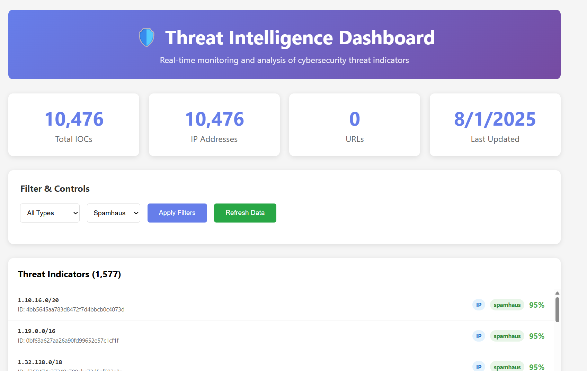

 🛡️ Threat Intelligence Processing System (Flask)

A mini threat intelligence pipeline that ingests open-source threat feeds, normalizes and enriches them, deduplicates entries, and exposes the data via a Flask REST API with a visual frontend.

---



## 🚀 Features

- ✅ Fetch threat data from:
  - `blocklist.de` (IP)
  - `spamhaus.org` (IP ranges/CIDR)
  - `digitalside.it` (Malicious URLs)
- ✅ Normalize all IOCs into a unified schema
- ✅ Enrich IPs using a mock database
- ✅ Filter suspicious URLs by extension
- ✅ De-duplicate repeated IOCs
- ✅ Store IOCs locally (or via MongoDB)
- ✅ View, search, and export from a web dashboard

Video Explanation: na

---

## 📂 Project Structure


## 🔄 Data Flow

1. **/refresh** (API call or button)
2. Downloads all feeds
3. Normalizes + enriches + filters + deduplicates
4. Saves into `data/iocs.json` or MongoDB
5. Results shown on dashboard `/public/index.html`

---

## 🧪 How to Run

```bash
# 1. Install dependencies
pip install -r requirements.txt

# 2. Start Flask server
python run.py

# 3. Access:
# API:        http://localhost:5000/iocs
# Dashboard:  http://localhost:5000/public/index.html
```

---

## 🧠 IOC Schema (Sample)

```json
{
  "id": "d4c67...",
  "value": "43.242.128.0/22",
  "type": "ip",
  "source": "spamhaus",
  "source_url": "http://www.spamhaus.org/drop/drop.txt",
  "category": "botnet_range",
  "first_seen": "2025-08-01T08:00:00Z",
  "last_updated": "2025-08-01T08:00:00Z",
  "confidence": 0.95,
  "metadata": {
    "sbl_reference": "SBL123456",
    "line_number": 45
  }
}
```

---

## 📈 Optional Enhancements

- [ ] Export IOCs to CSV
- [ ] Add ML classifier for suspicious URLs
- [ ] Use Celery for async background jobs
- [ ] Replace JSON with MongoDB or Elasticsearch
- [ ] Add charts with Chart.js / ECharts

---

## 🧠 Assumptions

- Feeds are public and stable
- IP enrichment uses mock DB to avoid rate limits
- UTC timestamps used throughout
- Refresh is manual (can be scheduled with CRON or Celery)

---

## 📜 License

MIT License. Built for educational/demo purposes.

---

## 🛠️ Installation & Setup

### Prerequisites

- Python 3.10
- Flask
- Requests library
- Optional: MongoDB (for production storage)

### Quick Start

1. **Clone the repository**
   ```bash
   git clone <repository-url>
   cd threat_intel_pipeline
   ```

2. **Create virtual environment**
   ```bash
   python -m venv venv
   source venv/bin/activate  # On Windows: venv\Scripts\activate
   ```

3. **Install dependencies**
   ```bash
   pip install -r requirements.txt
   ```

4. **Run the application**
   Add API in .env
   ```bash
   python pipeline.py
   python run.py
   ```

5. **Access the application**
   - API: http://localhost:5000/
   - Dashboard: http://localhost:5000/public/index.html

---

## 🔌 API Endpoints

| Endpoint | Method | Description |
|----------|--------|-------------|
| `/iocs` | GET | Retrieve all IOCs |
| `/iocs/<id>` | GET | Get specific IOC by ID |
| `/refresh` | POST | Trigger feed refresh |
| `/stats` | GET | Get pipeline statistics |
| `/health` | GET | Health check endpoint |
| `/search` | GET | Search IOCs by parameters |

---

## 🎨 Dashboard Features

- **IOC Viewer**: Browse all indicators with pagination
- **Search & Filter**: Filter by type, source, confidence level
- **Statistics**: View feed counts and processing metrics
- **Export**: Download IOCs in JSON/CSV format
- **Refresh Control**: Manual pipeline trigger from UI

---

## ⚙️ Configuration

### Environment Variables

```bash
FLASK_ENV=development
FLASK_DEBUG=True
STORAGE_TYPE=json  # or mongodb
MONGODB_URI=mongodb://localhost:27017/threat_intel
LOG_LEVEL=INFO
```

### Feed Sources

The system currently supports these threat intelligence feeds:

- **Blocklist.de**: Provides malicious IP addresses
- **Spamhaus DROP**: IP ranges of known compromised networks
- **DigitalSide**: Malicious URLs and domains

---

## 🔧 Development

### Running Tests

```bash
python -m pytest tests/
```

### Adding New Feeds

1. Create a new ingestion module in `ingestion/`
2. Implement the feed parser
3. Register the feed in the main pipeline
4. Update configuration as needed

### Custom Enrichment

Add enrichment modules in `enrichment/` to:
- Perform geolocation lookups
- Add threat categorization
- Calculate confidence scores
- Apply custom filtering rules

---

## 🚀 Production Deployment

### Docker Deployment

```bash
docker build -t threat-intel-pipeline .
docker run -p 5000:5000 threat-intel-pipeline
```

### Scaling Considerations

- Use Gunicorn + Nginx for production WSGI serving
- Implement Redis/Celery for background job processing
- Switch to MongoDB/Elasticsearch for better performance
- Add API authentication and rate limiting
- Set up monitoring with Prometheus/Grafana

---

## 🤝 Contributing

1. Fork the repository
2. Create a feature branch
3. Make your changes
4. Add tests for new functionality
5. Submit a pull request

---

## 📞 Support

For questions or issues:
- Create an issue on GitHub
- Check the documentation in `/docs`
- Review the API documentation at `/api/docs` when running

---

## 🔒 Security Notice

This is a demonstration system intended for educational purposes. For production use:

- Implement proper authentication
- Add input validation and sanitization
- Use HTTPS for all communications
- Regularly update dependencies
- Follow security best practices for threat intelligence handling